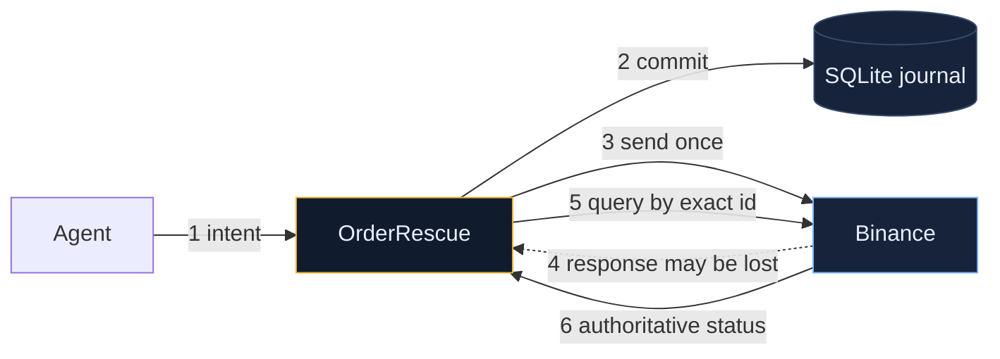
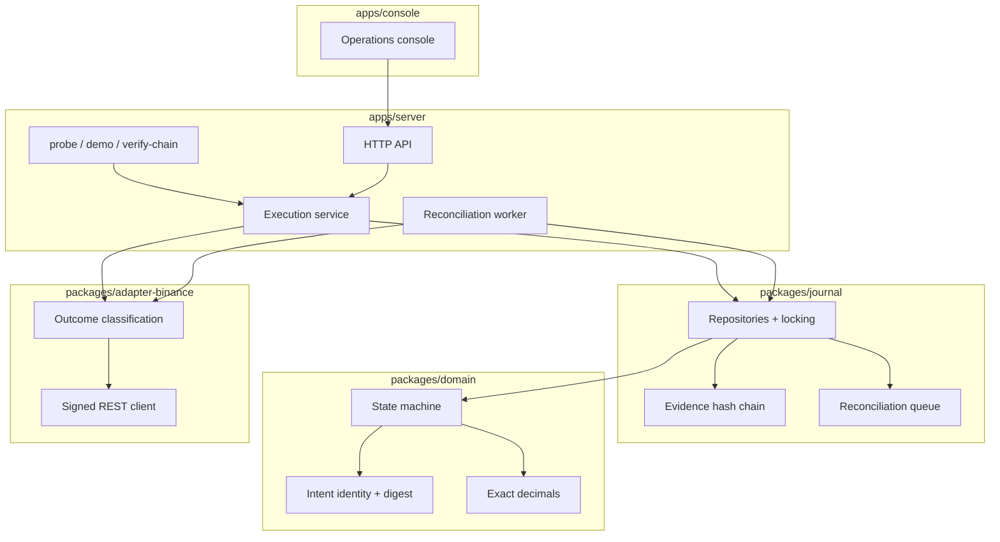
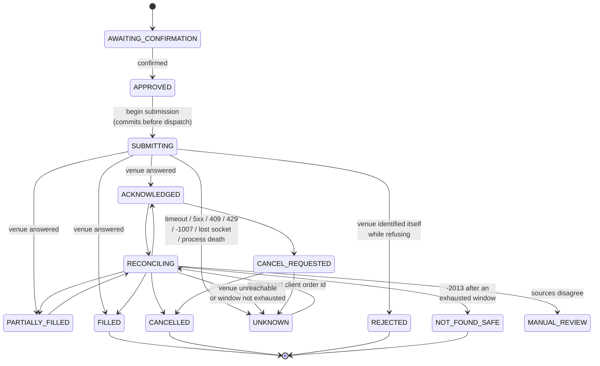
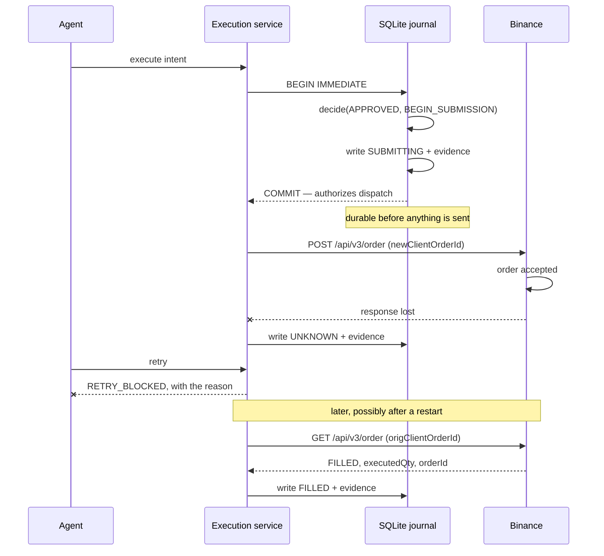

# Architecture

## The shape of the problem

Everything here follows from one asymmetry: **the transport outcome and the economic outcome are different facts, and only one of them is observable locally.**

Step 4 is the one everybody gets wrong. A lost response says nothing about whether step 3 had an effect. Step 5 is only possible because the identifier was chosen and committed at step 2.

## Layers

`packages/domain` is pure: no HTTP, no SQLite, no clock. Every state change in the system passes through its `decide()` function, so an invariant proved there holds for the API, the worker, the CLI, and the recovery path alike.

## Lifecycle

The shaded region of that diagram — `SUBMITTING`, `UNKNOWN`, `RECONCILING`, `ACKNOWLEDGED`, `PARTIALLY_FILLED`, `FILLED`, `CANCEL_REQUESTED`, `MANUAL_REVIEW` — is the set of states where the venue may already hold an economic action. No new dispatch is authorized from any of them, and each has a specific sentence explaining why.

## Ordering guarantees on the critical path

Two properties come out of that ordering:

1. **Nothing is sent that is not already on disk.** A process killed between the commit and the response reopens knowing an order might exist.
2. **Nothing is sent twice.** The commit that authorizes dispatch also moves the operation out of `APPROVED`, and the transaction is `BEGIN IMMEDIATE`, so a concurrent request serializes behind it and then finds a state that refuses.

## Evidence chain

Each event is hashed over `(sequence, operationId, eventType, source, timestamps, payloadDigest, facts, previousEventHash)`, chained across the whole journal rather than per operation. That makes a deleted row visible as a sequence gap and a reordered one visible as a broken link.

Facts are redacted before hashing, so the digest covers exactly what is stored and exactly what is exported. `pnpm verify-chain` recomputes the chain and names the sequence number of the first break.

## Where an Agent OS adapter goes

`packages/adapter-binance/src/adapter.ts` defines `ExecutionAdapter`. An Agent OS implementation slots in beside `BinanceSpotAdapter` without touching the domain, the journal, or the console — provided it can carry a caller-chosen identifier through placement and back out through status. Whether it can is the open question recorded in [integration-gate.md](./integration-gate.md).
